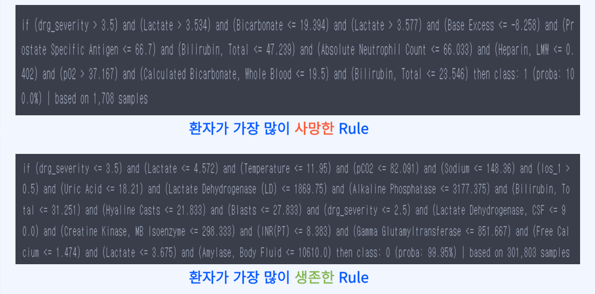

# 2023_fall_DA_teamproject

## 환자 정보를 이용한 사망 위험도 분석

MIMIC-IV 데이터의 기본적인 환자 입원 정보와 의료 검사 결과를 이용하여 환자의 사망 예측 모델링 및 결과에 따른 케어 시나리오 생성을 진행하였습니다.

 

### 활용 데이터 및 전처리
https://physionet.org/content/mimiciv/2.2/ 

MIMIC IV 데이터 셋의 위 테이블을 hadm_id 컬럼을 기준으로 merge 후 사용

 

- discharge_location, dod 등 data leakage 위험이 있는 컬럼은 삭제
- 모든 입/퇴원 시간을 퇴원시간 - 입원시간 값으로 변환, sqrt 적용 후 이산화
- object type features를 one-hot encoding
- 결측치는 0 처리, 측정 오류 feature들은 drop

 

### 활용 알고리즘
deep learning 모델과 tree-based model을 각각 둘씩 활용 (기본적인 모델 하나, tabular dataset에서 SOTA 성능을 보이는 모델 하나)

- DL Models
    - Multiplayer Perceptron
    - TabNet

- Tree based Models
    - Decision Tree
    - XGBoost

 

### 학습/최적화
#### Training
- train, val, test 비율은 각 7:1:2
- Seed 및 실험 하드웨어 고정
- feature importance 도출 후, importance 0인 feature는 drop
- DL model에는 scaling 및 oversampling 진행

#### Optimization
- Tree based model들은 grid search
- DL model들은 Optuna로 tuning

 

### 실험 결과
- baseline model은 Decision Tree model
- 성능 지표는 f1-score와 2종 오류의 심각성을 고려하여 recall 사용
- XGBoost가 f1-score, recall값 모두 가장 뛰어났지만, baseline인 Decision Tree 모델도 나쁘지 않은 결과를 보임

 

### 활용 방안
1. Decision Tree 모델로 상위 rule extraction
    - 도메인 지식이 있는 의료진에 인사이트 도출

 

2. XGBoost로 시나리오 분석 진행
    - 중요 변수 변화에 따른 환자 별 사망 위험도 변화 파악

 

#### rule extraction
Decision Tree의 특성을 활용하여 생존과 사망에 가장 큰 영향을 미친 규칙을 텍스트 형식으로 추출. 예를 들어, 사망자를 가장 많이 분류한 규칙의 첫 두 조건은 drg_severity가 3보다 크고 젖산 수치가 3.5를 초과하는 경우. 트리의 최상위 수준에서 이 두 조건은 가장 많은 사망자를 분류하는 데 크게 영향을 미쳤음을 확인 가능

#### 시나리오 분석
특정 환자의 주요 변수 5가지를 조합한 n개의 합성 데이터 생성 후 이전 실험에서 가장 좋은 성능을 보였던 XGBoost로 사망과 생존 확률의 변화를 관찰

 

각 샘플 중 XGBoost의 사망으로 예측할 logit 값이 가장 높을 경우와 낮을경우를 뽑아서 해당 환자의 실제 정보와 비교. 위 환자는 Lactate, Bicarbonate, pCO2 수치를 낮추는 방향으로 케어할 필요성이 있다는 것을 도출할 수 있음
